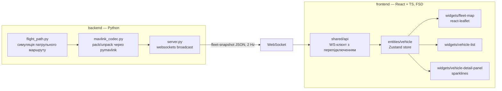

# Fleet Telemetry Dashboard

Операційний дашборд реального часу для моніторингу дрон-флоту: живі позиції на карті,
статус кожного апарата та потокова телеметрія — інструмент, яким користувався б оператор
inspection- або agri-survey флоту, спостерігаючи одразу за кількома БПЛА в польоті.

Зроблено як портфоліо-проєкт, щоб продемонструвати повний конвеєр даних реального часу:
джерело телеметрії, що коректно відтворює протокол, WebSocket-транспорт і типізовану,
компонентну архітектуру фронтенду.

## Архітектура



На кожному тіку backend пакує симульований стан кожного апарата у справжні MAVLink v2
фрейми (`HEARTBEAT`, `GPS_RAW_INT`, `GLOBAL_POSITION_INT`, `VFR_HUD`, `SYS_STATUS`) за
допомогою `pymavlink`, а потім одразу декодує їх назад — тобто JSON, що йде по мережі,
збудований з реального round-trip'у протоколу, а не є вручну зімітованим замінником.
Див. [`backend/telemetry_mock/mavlink_codec.py`](backend/telemetry_mock/mavlink_codec.py).

## Стек

- **Backend**: Python, `pymavlink`, `websockets`
- **Frontend**: React 19, TypeScript, Vite, Tailwind CSS v4, Zustand, react-leaflet
- **Архітектура**: Feature-Sliced Design (`app / pages / widgets / entities / shared`)

## Запуск

Найпростіше — однією командою (сама встановить venv/залежності, якщо їх ще нема,
і підніме backend + frontend разом; `Ctrl+C` зупиняє обидва):

```bash
./scripts/dev.sh
```

Або вручну, у двох терміналах:

**Backend** (термінал 1):

```bash
cd backend
python3 -m venv .venv
source .venv/bin/activate
pip install -r requirements.txt
python -m telemetry_mock
```

**Frontend** (термінал 2):

```bash
cd frontend
npm install
npm run dev
```

Відкрийте виведену адресу `localhost` — дашборд підключиться до `ws://localhost:8765`,
і за кілька секунд на карті з'являться п'ять симульованих апаратів.

## Архітектурні рішення

- **Feature-Sliced Design** робить відповідальність кожного шару очевидною:
  `entities/vehicle` володіє доменом (типи, стор, WS-підключення, дрібні UI-атоми),
  `widgets` компонують це в карту/список/панель, `pages` збирає layout. Усі папки й
  файли — у kebab-case.
- **Мінімум явної типізації.** Вручну написаний лише один тип — `Vehicle`, бо це єдине
  місце, де TypeScript нічого не може вивести сам (межа WebSocket-контракту). Усюди
  інде типи виводяться з цієї межі через inference.
- **Жодних primitives прямо в коді.** "Магічні" рядки й числа (стани з'єднання, підписи
  GPS fix, пороги батареї, дефолти карти, затримка перепідключення) винесені в
  [`shared/config/constants.ts`](frontend/src/shared/config/constants.ts) як
  `as const`-об'єкти, а не розкидані по коду літерали чи TS enum'и.
- **Без бібліотеки графіків.** Історія телеметрії — невеликий ring buffer
  ([`entities/vehicle/lib/telemetry-history.ts`](frontend/src/entities/vehicle/lib/telemetry-history.ts)),
  який рендериться як власноруч написаний SVG-sparkline — цього достатньо для
  індикатора тренду без зайвої залежності на чарти.
